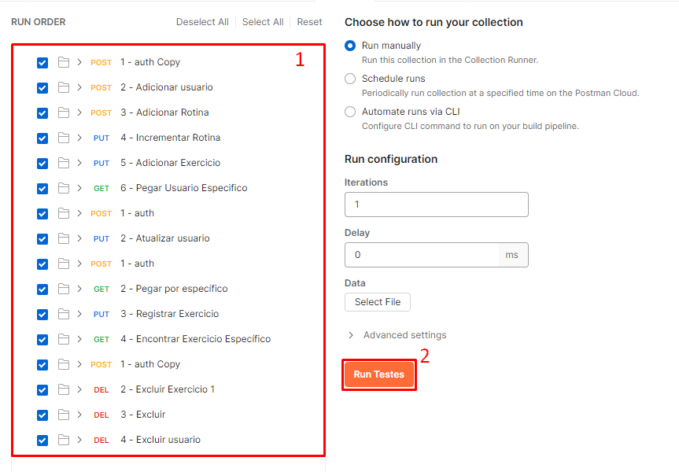

# Testes Funcionais da API do projeto Easy Training Log
Nesta etapa inicial, foi escrita somente as jornadas de sucesso mínimo para garantir que as features estão fucionando (CRUD de usuário e senha). 

Os testes Funcioniais do back-end do sistema foram escritos em Chai Assertions, de forma que nativamente o mesmo é executado no Postman pela aba *Tests*. Desta forma, conseguimos executar uma bateria de testes de forma rápida e prática.

## Configurando o Ambiente
Para rodar os testes, primeiro, tenha o Postman instalado. Depois, você precisará importar a Collection *Testes.postman_collection.json* e a enviroment *Easy Training Log Testes.postman_environment*.

## Entendendo a Organização dos Testes

### Pastas

Quando importar a collection, verá a seguinte organização de pastas:

 - Jornadas Positivas:
    - Pasta que armazena jornadas dos usuários, nomeadas estratégicamente sobre o que os testes dentro dela fazem (obs.: Devem ser executadas na ordem da imagem, de cima para baixo);
- Adicionar Usuário, rotina e treino
    - Rotina com perfil ADM, em que realiza cadastro de usuário, rotina e treino para o mesmo;
- Editar Usuário
    - Rotina como ADM, em que realiza a edição de nome do usuário adicionado anteriormente 
- Novo Usuário -  Ver rotinas e editar treino
    - Rotina como USER, em que são acessados os endpoints de visualizar suas rotinas e registrar seus treinos;

- Excluir exercício, usuário e rotina
    - Rotina como ADM, em que é excluído todos os registros feitos nesta jornada.

### Importância de rodar os testes na ordem da imagem
No postman, possuímos 4 abas muito importantes para as nossas requests: **Headers** (onde colocamos nosso Token), **Body** (onde fica o nosso request Body), Pre-request Scripts (scripts que são executados antes do postman realizar a request, podendo processar e salvar dados) e a aba **Tests**(onde ficam os nossos scripts de testes).

Em alguns testes, como o 2° da primeira jornada (Adicionar Usuario), é adicionado uma variável chamada id_usuario, que é usada ao longo dos testes para poderem ser feitas requests de get, put e delete para aquele id de usuário.

## Rodando os Testes
Para rodar os testes, é bem simples. Basta clicar na opção "Run Folder" no ícone de opções da pasta **Jornadas Positivas**:

Depois, abrirá a seguinte janela:

Aqui, você verá todas as requests (1) e o botão que acionará os testes (2). Clique neste botão.

Por fim, temos a tela que mostra um relatório dos testes:

Aqui, podemos ver uma tela (1) com informações sobre os nomes dos Testes (2) e o status quantitativos dos testes (3). Estes status nos mostram a quantidade de testes que passaram (Passed), falharam (Failed) e que não foram executados (skipped).

Além disso, temos um botão laranja escrito **Run Again** para executar esta bateria de testes.